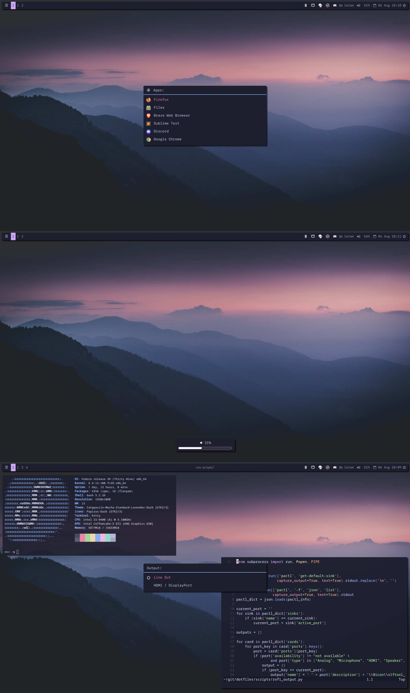

# Dotfiles

Configuration files for
- i3
- polybar
- picom
- dunst
- rofi
- betterlockscreen
- kitty and alacritty
- neovim

Each directory in this repository replicates the config directory for each tool. 

For example:
``` 
picom/
├── bnw.conf
├── catppuccin.conf
├── dracula.conf
└── i3-transparent.conf
```
Note that there are multiple config files for picoms, while the default one is `~/.config/picom/picom.conf`.
The idea is to preserve various themes and apply the one desired.

To do so, the target files are defined in `links` like 

```
picom/i3-transparent.conf=.config/picom/picom.conf
```

This file is parsed by `create_links.sh` to create the symbolic links accordingly. 


